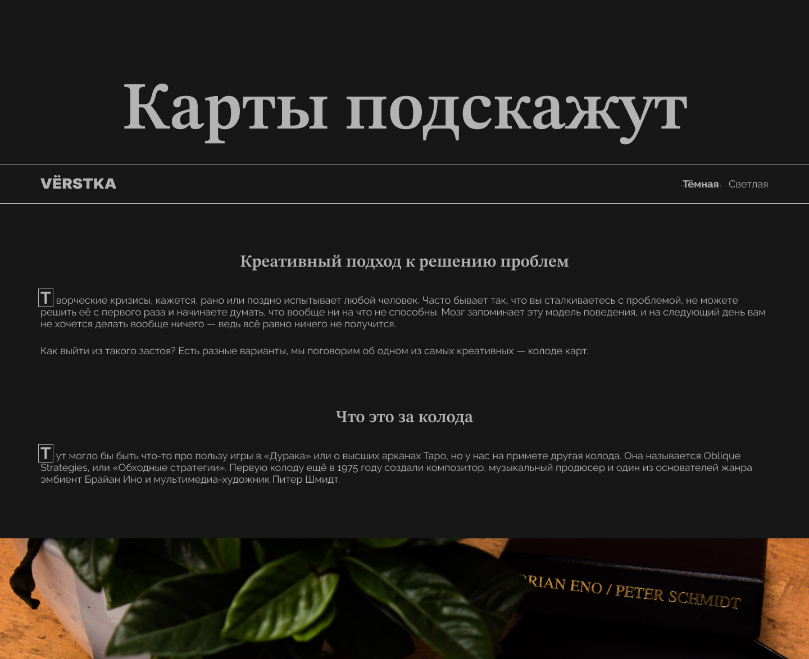

<h1>Карты подскажут</h1>

<figure>
  
  <figcaption>Светлая тема</figcaption>
</figure>

<figure>
  
  <figcaption>Темная тема</figcaption>
</figure>

<h2>Описание</h2>

Одностраничный сайт, стилизован под разную ширину экрана. Имеет две темы оформления: светлую и темную.

Сайт посвящен теме преодоления творческого кризиса в любой сфере и тому, как с помощью колоды карт "Обходные стратегии" можно решить возникшую проблему.

Функционал:

<ul>
  <li>переключение темы оформления сайта (светлая/темная).</li>
</ul>

<h2>Технологии</h2>
<ul>
  <li>HTML:
    <ul>
      <li>семантическая разметка;</li>
      <li>оптимизация изображений (разный формат, разрешение, ленивая загрузка).</li>
    </ul>
  </li>
  <li>CSS:
    <ul>
      <li>flexbox;</li>
      <li>логические свойства;</li>
      <li>псевдоклассы (first-of-type, last-of-type, not, hover, focus, focus-visible);</li>
      <li>псевдоэлементы (before, after, first-letter);</li>
      <li>переменные;</li>
      <li>относительные единицы измерения (резиновая верстка);</li>
      <li>функции calc() и clamp() (резиновая верстка).</li>
    </ul>
  </li>
</ul>

<h2>Ссылка на макет</h2>
<a href="https://www.figma.com/file/jhUMx3MqqQGIWhfjg0xNvO/%235-Карты-подскажут-(Copy)?node-id=411%3A101&mode=dev">Открыть</a>

<h2>Ссылка на проект</h2>
<a href="https://juliadik.github.io/karty-podskazhut/index.html">Открыть</a>